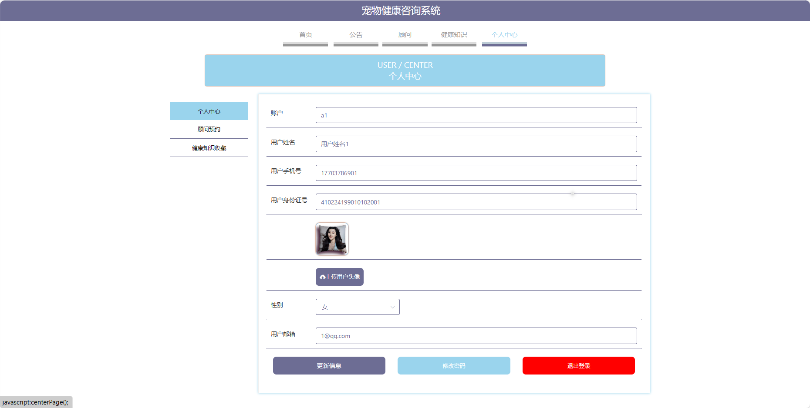
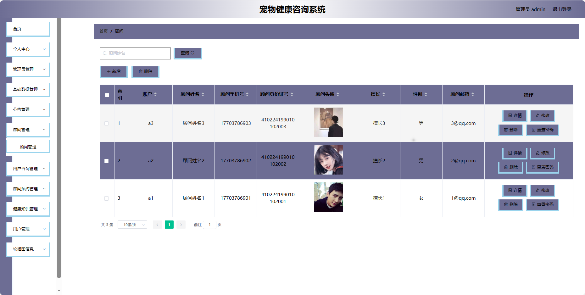
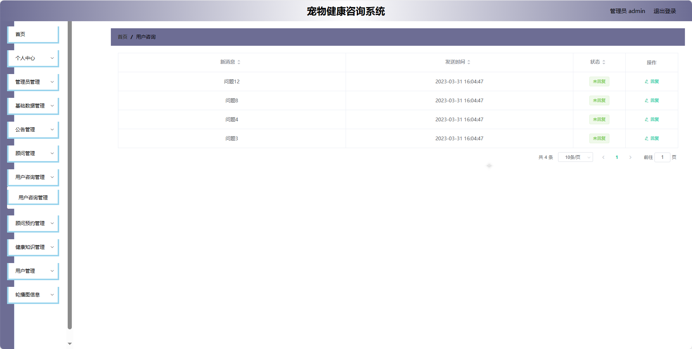
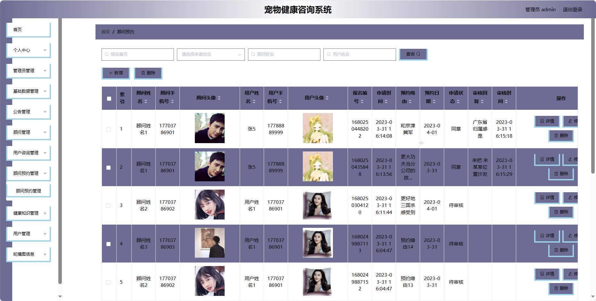
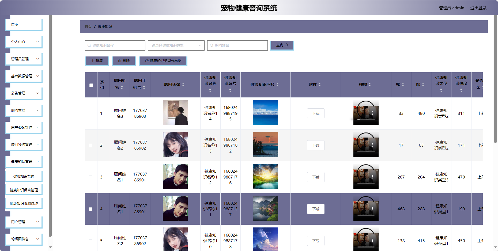

## 基于SpringBoot的宠物健康咨询系统(程序+报告)

###  获取sql数据库文件: 从戎源码网 (https://armycodes.com/) QQ: 386869957 QQ群: 377586148
###  所有系统地址: (https://github.com/YuLin-Coder/AllProjectCatalog) 
###  所有项目以及源代码本人均调试运行无问题 可支持远程安装部署调试、定制修改、代码讲解

## 项目介绍
基于SpringBoot的宠物健康咨询系统，系统包含三种角色：管理员、用户，顾问主要功能如下。

### 【管理员】:
1. 系统首页：查看系统整体情况和关键信息。
2. 个人中心：管理管理员的个人信息。
3. 管理员管理：维护系统管理员的账户信息。
4. 基础数据管理：管理系统的基础数据。
5. 公告管理：发布、编辑和管理系统的公告信息。
6. 顾问管理：管理可提供咨询服务的顾问信息。
7. 用户咨询管理：查看和管理用户的咨询信息。
8. 顾问预约管理：处理用户对顾问的预约请求。
9. 健康知识管理：发布、编辑和管理健康知识信息。
10. 用户管理：维护系统用户的账户信息。
11. 轮播图信息：管理系统首页轮播图的展示内容。

### 【用户】:
1. 首页：查看系统主要信息和最新动态。
2. 公告：浏览系统发布的公告信息。
3. 顾问：浏览可提供咨询服务的顾问列表。
4. 健康知识：获取系统提供的健康知识信息。
5. 个人中心：管理个人信息。

### 【顾问功能】
1. 首页：查看系统主要信息和最新动态。
2. 个人中心：管理顾问的个人信息。
3. 公告管理：发布、编辑和管理顾问相关的公告信息。
4. 用户咨询管理：查看和管理用户对顾问的咨询信息。
5. 顾问预约管理：处理用户对顾问的预约请求。
6. 健康知识管理：发布、编辑和管理顾问分享的健康知识。

## 项目技术
- 编程语言：Java
- 数据库：MySQL
- 项目管理工具：Maven
- 前端技术：HTML、CSS、JavaScript、Jquery、Vue
- 后端技术：Spring、SpringMVC、MyBatis

## 运行环境
- JDK版本：JDK1.8及以上
- 开发工具：IDEA、Ecplise、Myecplise都可以
- 数据库: MySQL5.7及以上
- Maven：maven3.0及以上
- Node：14.14.0及以上

## 运行截图

